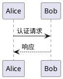
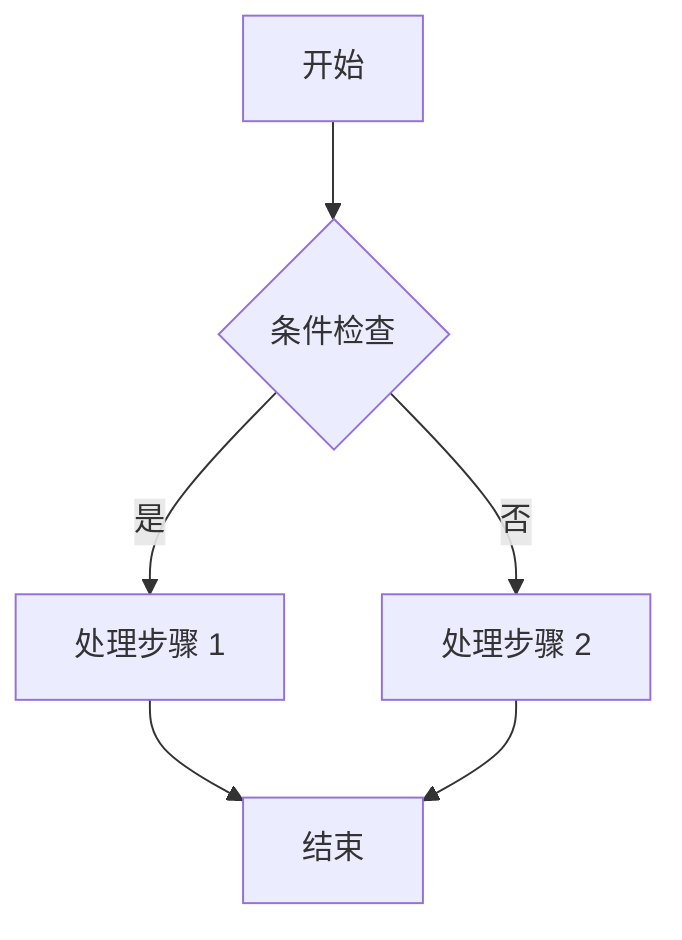

# 一级标题
## 二级标题
### 三级标题
**加粗**  
*斜体*  
~~删除线~~  
`code`
> 引用
- 1
- 1
- 1


1. 2
2. 3
3. 4

- [x] 第一个任务
- [x] 第二个
- [ ] 第三个


---

[bilibili](https://www.bilibili.com/video/BV1yp326PEVc/?spm_id_from=333.337.search-card.all.click&vd_source=1ac54e05482e541895201393992cf8b3 "b站")

这是一个slug链接[[50]]

这是一个文章卡片  
![[50]]


| 列 1 | 列 2 | 列 3 |
| :---: | :---: | :---: |
|  1  |  2  |  3  |
|  4  |  5  |  6  |
|  7  |  8  |  9  |

```js
function debounce(fn, ms) {

  let t; return function (...a) { clearTimeout(t); t = setTimeout(() => fn.apply(this, a), ms); };

}
```


```js showLineNumbers
function debounce(fn, ms) {  
  let t; return function (...a) { clearTimeout(t); t = setTimeout(() => fn.apply(this, a), ms); };  
}
```


::: code-group labels=[JavaScript, js, js]
```js
console.log("Hi");
```
```js
function debounce(fn, ms) {  
  let t; return function (...a) { clearTimeout(t); t = setTimeout(() => fn.apply(this, a), ms); };  
}
```
```js
function debounce(fn, ms) {  
  let t; return function (...a) { clearTimeout(t); t = setTimeout(() => fn.apply(this, a), ms); };  
}
```
:::

:spoiler[隐藏内容]


::github{repo="ly-x1anyu/Firefly-Markdown"}


<iframe width="100%" height="468" src="//player.bilibili.com/player.html?bvid=BV1h7QgBGESZ&p=1&autoplay=0&high_quality=1&danmaku=0" scrolling="no" border="0" frameborder="no" framespacing="0" allowfullscreen="true"></iframe>


<iframe width="100%" height="468" src="https://www.bilibili.com/video/BV1h7QgBGESZ/?spm_id_from=333.337.search-card.all.click&vd_source=1ac54e05482e541895201393992cf8b3" frameborder="0" allowfullscreen></iframe>








[grid]  
  
  
  
[/grid]


> [!NOTE]
> 提示内容


> [!TIP]
> 提示内容


> [!IMPORTANT]
> 提示内容


> [!WARNING]
> 提示内容


> [!CAUTION]
> 提示内容


> [!info]
> 提示内容


> [!danger]
> 提示内容


