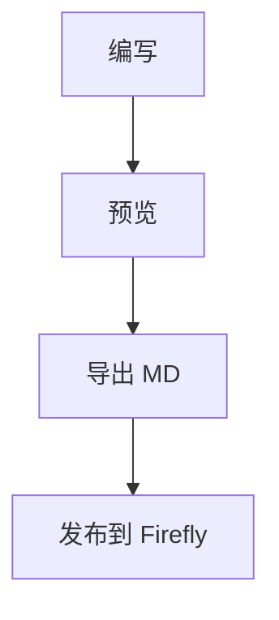

---
title: 欢迎使用 Firefly Markdown
published: 2026-08-04
description: 一款纯前端、零依赖、离线可用的 Astro-Firefly 博文生成器。
tags: [Astro, 博客, 工具]
category: 工具分享
pinned: false
slug: "50"
comment: true
licenseName: CC BY-NC-SA 4.0
licenseUrl: "https://creativecommons.org/licenses/by-nc-sa/4.0/deed.zh"
---

# 欢迎使用 Firefly Markdown

这是一款 **纯前端 · 零依赖 · 离线可用** 的博文生成器，为 [Astro-Firefly](https://github.com/CuteLeaf/Firefly) 主题量身打造。

## 快速开始

1. 在左侧填写文章信息，FrontMatter 会自动生成
2. 在中间编写正文，支持工具栏、快捷键与 `/` 命令
3. 右侧实时预览，确认无误后点击「导出 MD」

> [!TIP]
> 输入 `/` 可以唤出快捷命令菜单，试试看。

## 扩展语法演示

剧透遮罩：这里有个秘密 :spoiler[其实我没有秘密 **嘿嘿**]，把鼠标移上去看看。

高亮文本：==这段文字会被高亮==；任务清单：

- [x] 支持完整 FrontMatter
- [x] 内置 Markdown 编辑器
- [ ] 写一篇真正的文章

```js
// 代码块自带语法高亮  
const hello = (name) => `Hello, ${name}!`;  
console.log(hello('Firefly'));
```

::github{repo="CuteLeaf/Firefly"}

## 数学公式（KaTeX）

行内公式：质能方程 $E = mc^2$ 与欧拉恒等式 $e^{i\pi} + 1 = 0$。

$$
\int_{-\infty}^{\infty} e^{-x^2}\,dx = \sqrt{\pi}
$$

块级公式支持上标、下标、分式、根号与矩阵：

$$
\begin{pmatrix} a & b \\ c & d \end{pmatrix},\quad  
\sum_{n=1}^{\infty} \frac{1}{n^2} = \frac{\pi^2}{6}
$$

## 提示框与图表

:::tip[支持多种风格]
除了 GitHub 风格，还支持 Docusaurus 的 `:::tip` 与 Obsidian 的 `!!! note`。
:::



| 功能 | 状态 | 说明 |
| :--- | :--: | ---: |
| 离线可用 | ✅ | 双击 HTML 即可 |
| 自动缓存 | ✅ | 刷新不丢失 |
| 三端适配 | ✅ | 桌面 / 平板 / 手机 |


11111[^fn1]

[^fn1]: 脚注内容